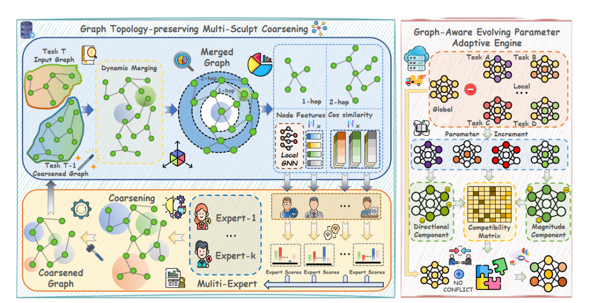

# MOTION: Multi-Sculpt Evolutionary Coarsening for Federated Continual Graph Learning


Guancheng Wan, Fengyuan Ran, Ruikang Zhang, Wenke Huang, Xuankun Rong, Guibin Zhang, Yuxin Wu, Bo Du, Mang Ye

<p align="center">
  
</p>

## ✨ Abstract
Federated continual graph learning (FCGL) studies incremental learning on dynamic graphs distributed across clients. Existing approaches cannot simultaneously preserve graph topology across tasks and avoid server-side aggregation conflicts. MOTION introduces:
- **G-TMSC** (Graph Topology-preserving Multi-Sculpt Coarsening) to retain critical subgraph structures via similarity-guided, multi-expert coarsening on clients.
- **G-EPAE** (Graph-Aware Evolving Parameter Adaptive Engine) to adapt aggregation with a topology-sensitive compatibility matrix on the server, reducing conflicting updates.

This design improves stability and generalization for FCGL while keeping privacy constraints.

## 🚀 Getting Started
### Requirements
- Python 3.9+
- PyTorch (GPU recommended)
- PyTorch Geometric (PyG)
- Common libs: numpy, scipy, scikit-learn, networkx, tqdm, ogb

Install PyTorch and PyG per your CUDA/version from their official guides, then:
```bash
pip install -U numpy scipy scikit-learn networkx tqdm ogb
```
 
### Quick Start
```bash
python main.py \
  --fed_algorithm MOTION \
  --dataset cora \
  --model GAT \
  --num_clients 2 \
  --num_rounds 1 \
  --skew_type label_skew \
  --num_classes_per_task 1 \
  --num_classes 7 \
  --device_id 0 \
  --dirichlet_alpha 1.0 \
  --seed 0
```
## ⚙️ Key Hyperparameters
- **dataset**: cora | citeseer | pubmed | ...
- **model**: GNN backbone (default `GAT`). See `backbone/`.
- **num_clients, num_rounds**: FL scale and communication rounds.
- **skew_type**: data partition, e.g., `label_skew` or `domain_skew`.
- **dirichlet_alpha**: non-IID degree (↑ more uniform).
- **num_tasks, num_classes, num_classes_per_task**: FCGL scheduling.
- **hidden_dim, num_layers, dropout, learning_rate, weight_decay**: GNN basics.
- MOTION-specific: **reduction_rate**, **expert_select**, **node_reduction_rate**, **k_list**. See `args.py` for defaults.
- Datasets are handled under `datasets/` and by default stored in `datasets/raw_data` (change via `--dataset_dir`).
- Node classification task is the current default (`args.task=node_classification`).
- Logs are saved to `logs/` (change via `--logs_dir`).

##  Project Layout
- `main.py`: entry point that parses `args` and launches `TaskFlow`.
- `utils/taskflow.py`: dispatches to `tasks/node_classification_task.py`.
- `tasks/`: training/evaluation pipelines for tasks.
- `algorithm/MOTION.py` and `algorithm/`: MOTION core (G-TMSC, G-EPAE utils in `algorithm/utils/`).
- `backbone/`: GNN backbones (e.g., `GAT.py`).
- `datasets/`: loading, partitioning, processing utilities.
- `logs/`: outputs.

##  Citation
If you find this repository useful, please consider citing:

```bibtex
@inproceedings{MOTION_NeurIPS25,
  title={{MOTION}: Multi-Sculpt Evolutionary Coarsening for Federated Continual Graph Learning},
  author={Wan, Guancheng and Ran, Fengyuan and Zhang, Ruikang and Huang, Wenke and Rong, Xuankun and Zhang, Guibin and Wu, Yuxin and Du, Bo and Ye, Mang},
  booktitle={NeurIPS},
  year={2025}
}
```