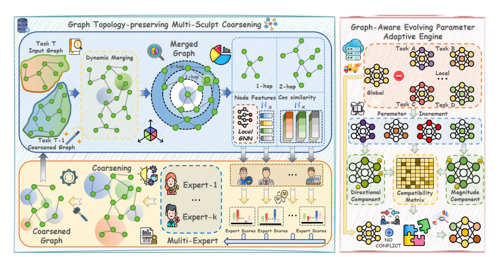

# MOTION: **Multi-Sculpt Evolutionary Coarsening for Federated Continual Graph Learning**

Authors: Guancheng Wan+, Fengyuan Ran+, Ruikang Zhang, Wenke Huang, Xuankun Rong, Guibin Zhang, Yuxin Wu, Bo Du, Mang Ye

<p align="center">
  
</p>

## 🔥 News

2025/10 💥 MOTION is accepted by NeurIPS 2025！！🎉🎉

## Table of Contents

- Overview
- Highlights
- Installation
- Quick Start
- Key Hyperparameters
- Project Layout
- Citation

## ✨Overview

MOTION addresses Federated Continual Graph Learning (FCGL): incremental learning over dynamically evolving graphs distributed across multiple clients. It focuses on two core challenges:

- Preserving graph topology across tasks on clients (so that important structural information is not lost during coarsening).
- Reducing server-side aggregation conflicts when combining client updates across evolving tasks.

Key components:

- G-TMSC — Graph Topology-preserving Multi-Sculpt Coarsening: similarity-guided, multi-expert coarsening that keeps critical subgraph structures on clients.
- G-EPAE — Graph-Aware Evolving Parameter Adaptive Engine: topology-sensitive compatibility and adaptive aggregation on the server to reduce conflicting updates.

These components together improve stability and generalization for FCGL while respecting federated privacy constraints.

## 💥Highlights

- Preserves local graph topology during coarsening.
- Adaptive, topology-aware server aggregation to reduce interference.
- Modular design: plug-in backbones (e.g., GAT) and datasets.
- Designed for node classification tasks in continual, federated settings.

## ⚒️Installation

Requirements

- Python 3.9+
- PyTorch (GPU recommended)
- PyTorch Geometric (PyG)
- Common libs: `numpy`, `scipy`, `scikit-learn`, `networkx`, `tqdm`, `ogb`

Install Python packages (after installing PyTorch/PyG according to your CUDA):

```powershell
pip install -U numpy scipy scikit-learn networkx tqdm ogb
```

## 🚀Quick Start

Run a small federated continual experiment on Cora with the GAT backbone:

```powershell
python main.py \
  --fed_algorithm MOTION \
  --dataset cora \
  --model GAT \
  --num_clients 2 \
  --num_rounds 1 \
  --skew_type label_skew \
  --num_classes_per_task 1 \
  --num_classes 7 \
  --device_id 0 \
  --dirichlet_alpha 1.0 \
  --seed 0
```

Notes

- Configure other options via `args.py` (e.g., `reduction_rate`, `expert_select`, `node_reduction_rate`, `k_list`).
- Datasets live under `datasets/raw_data` by default; change with `--dataset_dir`.

## ⚙️Key Hyperparameters

- **dataset**: `cora` | `citeseer` | `pubmed` | ...
- **model**: GNN backbone (default: `GAT`) — see `backbone/`.
- **num_clients**, **num_rounds**: federation scale and communication rounds.
- **skew_type**: partition strategy (`label_skew`, `domain_skew`, ...).
- **dirichlet_alpha**: controls label non-IID degree (higher → more uniform).
- **num_tasks**, **num_classes**, **num_classes_per_task**: continual learning scheduling.
- **hidden_dim**, **num_layers**, **dropout**, **learning_rate**, **weight_decay**: standard GNN params.
- MOTION-specific: **reduction_rate**, **expert_select**, **node_reduction_rate**, **k_list** — see `args.py` for defaults.
- Datasets are handled under `datasets/` and by default stored in `datasets/raw_data` (change via `--dataset_dir`).
- Node classification task is the current default (`args.task=node_classification`).
- Logs are saved to `logs/` (change via `--logs_dir`).

## 📖Project Layout

- `main.py`: entrypoint and experiment runner.
- `args.py`: default hyperparameter definitions and CLI flags.
- `algorithm/`: core MOTION algorithm and helpers (`MOTION.py`, `Base.py`, `utils/`).
- `backbone/`: GNN backbone implementations (e.g., `GAT.py`).
- `datasets/`: loading, processing, partitioning and helpers.
- `tasks/`: task implementations (`node_classification_task.py`, base task).
- `utils/`: logging, seeds, and `taskflow.py` which orchestrates experiments.
- `logs/`: default location for run outputs and checkpoints.

## 📌Citation

If you use MOTION in your research, please cite:

```bibtex
@inproceedings{MOTION_NeurIPS25,
  title={{MOTION}: Multi-Sculpt Evolutionary Coarsening for Federated Continual Graph Learning},
  author={Wan, Guancheng and Ran, Fengyuan and Zhang, Ruikang and Huang, Wenke and Rong, Xuankun and Zhang, Guibin and Wu, Yuxin and Du, Bo and Ye, Mang},
  booktitle={NeurIPS},
  year={2025}
}
```
